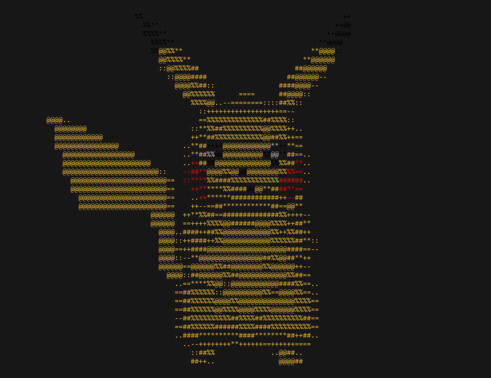

# Sloth

A one-of-a-kind command line 3D software rasterizer made with crossterm, tobj, stl, and nalgebra. Currently it 
supports OBJ file formats without textures or materials, or standard STL files. Here's a really simple command for you to get started.    
`cargo build --release`    
`./target/release/sloth models/Pikachu.obj`    
For multiple models:   
`./target/release/sloth "models/Pikachu.obj models/suzy.obj"`   
